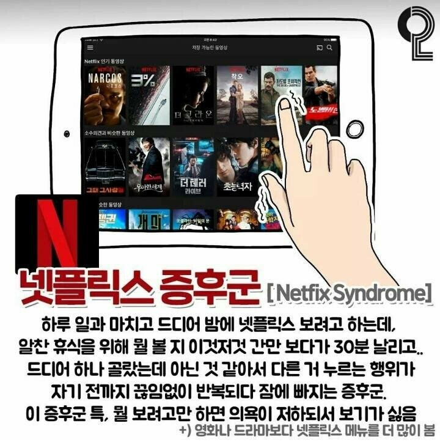
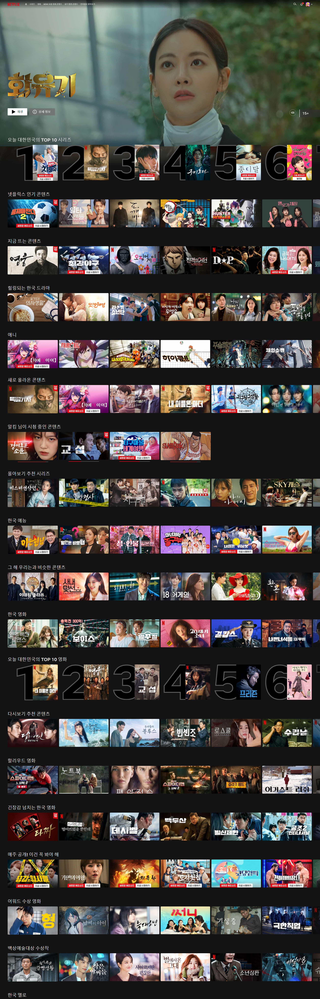
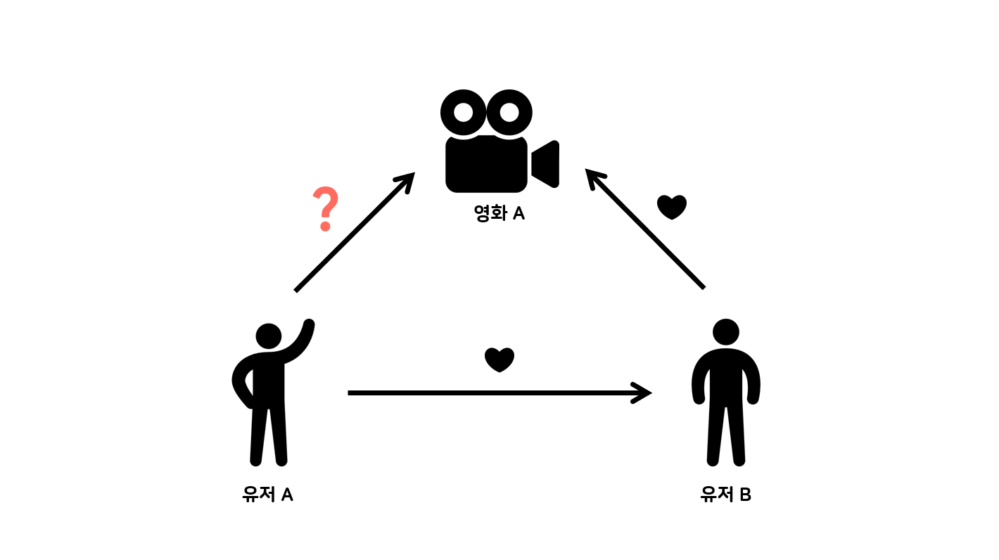
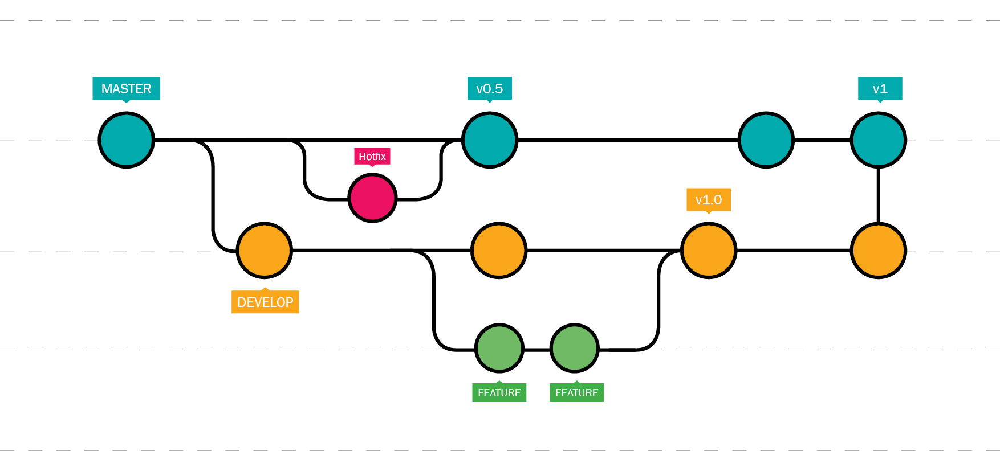
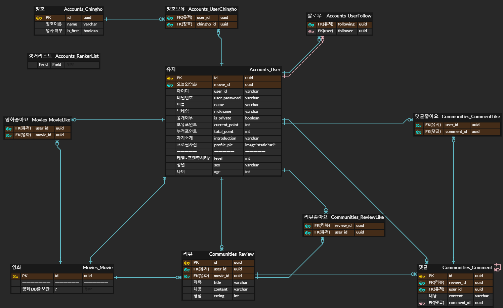

# Read me.md

# **WADAK**

팝콘이 터지는 의성어에서 유래된 이름.

영화와 관련된 팝콘에서 비롯된 단어로 시작해, 사람이 왁자지껄 모여 대화를 나누는 영화 추천 기반 커뮤니티 웹 서비스를 제공하겠다는 의미에서 이름을 따옴. 또한 유저간의 관계성을 중요하게 생각하는 개발 의도로 ‘와닿다’ 라는 의미도 가지고 있음

# 가. 개발 기획

## 1) 개발 기간

📚2023.05.17 ~ 2023.05.26

## 2_1) 현 문제점 파악

### 이렇게 많은데 볼 게 없네 …



‘넷플릭스 증후군’에 대해 아는가?

최근 OTT 이용자들 사이에서 작품을 고르다 시간을 보내는 ‘넷플릭스 증후군’을 겪는 경우가 늘어나고 있다.

넷플릭스 증후군은 실제 콘텐츠를 감상하는 시간보다 무엇을 볼 지 결정하는 데 걸리는 시간이 더 많은 현상, 또는 작품을 고르다 정작 본 목적인 영화나 드라마 감상은 하지 못하고 시간을 보내는 현상을 말한다.

이러한 증후군이 생기는 원인이 뭘까?

### 치명적인 2가지의 오류, 선택의 역설



[해당 이미지는 넷플릭스의 Main page를 구성하고 있는 모습을 나타냄]

해당 이미지는 넷플릭스의 현재 메인 페이지를 구성하고 있는 모습이다. 첫 번째로 대한민국의 **TOP 10**을 보여주고 이어서 넷플릭스의 **인기** 컨텐츠, 지금 **뜨는** 컨텐츠 순으로 보여주고 있다. 뒤에 이어서 계속 비슷한 양상의 추천 알고리즘이 돌아가고 있다. OTT사이트는 맞춤 / 추천 이라는 단어로 유저에게 다양한 영화를 제공하고 있지만, 결론적으로는 추천이 아닌 영화 자체를 기피하게 되버리는 아이러니한 상황(넷플릭스 증후군)을 만들어 버린다. 그렇다면 OTT 사이트에서 제공하는 알고리즘에 어떤 문제가 있는 것일까?

OTT 플랫폼은 자신들이 제공하는 추천 알고리즘의 실패를 줄이기 위해 2가지의 치명적인 오류를 숨기고 영화를 제공하고 있다.

1. **대중성**

“30대 남성에게 어울리는 영화”, “액션을 좋아하는 사람의 영화” 등 유저의 데이터를 활용하여 유저에게 맞춤 추천을 진행하고 있다. 하지만 이러한 키워드는 속에는 “대중성”이라는 약점이 존재하게 된다. 결론적으로 마지막 단에서 데이터를 분류할 때 레이팅으로 분류한다는 것이다. 이렇게 레이팅에 분류된 데이터는 비슷한 추천 결과를 만들고, 매력적이지 못하게 되어 그저 그런 추천 으로 유저에게 낙인되버린다.

2. **지나치게 많은 양**

그렇게 분류된 데이터가 또한 지나치게 많이 제공된다는 것이 또 다른 문제점이다. 실패를 막기 위해 한 번에 많은 데이터들이 제공되고, 결국 모든 책임은 “선택”해야하는 유저에게 돌아가게 된다. 그렇기에 적절한 선택을 하기위해 유저들이 피로감을 무의식적으로 느끼게 된다.

이러한 추천 알고리즘은 결국에는 **‘선택의 역설**’을 일으키게 된다.

대중적인 선택지가 너무 많으면 오히려 결정에 어려움을 겪을 수 있다는 것이다. 최근에는 사람들이 한 번에 여러 OTT 서비스를 이용하고, 콘텐츠 확보 경쟁이 치열해지며 다양한 콘텐츠가 쏟아져 나오고 있다. 이러한 콘텐츠의 홍수 속에서 하나를 선택하고 보기까지의 과정에서 피로감을 느낄 수 있다. 그렇기에 역설적으로 OTT 서비스를 이용하지 않는 지경에 이르게 된다.

## 2_2) 기획의도

### 긴밀하고 간결한 추천

위에서 언급한 추천이 결코 틀린 것은 아니다. 결국에는 많은 유저들이 이용하고 있고, 매번 OTT에서 나온 컨텐츠는 흥행이 되고, 돌고 돌아 다른 OTT, 다른 플랫폼 등에 파급효과를 일으키고 있다. 하지만 이렇게 “선택의 역설”에 빠져버린 유저가 점차 증가하고 있고, OTT 플랫폼을 더 이상 이용하지 않으려는 유저가 많아지니, 프로그램을 기획하고 개발하는 입장에서는 반드시 해결해야 한다.

### 어떻게? 관계성을 이용하여…

우리는 이러한 문제점을 어떻게 하면 해결할 수 있을까? 이러한 문제를 해결하기 위해서 색다른 추천 알고리즘으로 선택지를 줄여주고, 보다 결정하기 쉬운 기준으로 콘텐츠를 분류해 제시하는 방법이 있다. 넷플릭스에서는 한국에서 인기 많은 순위, 로맨스 드라마 종류 등 선택지를 줄인 추천 알고리즘을 제시하고 있다. 이러한 방식들을 기본적으로 채용하고, 와닥 팀만의 특색있는 추천 알고리즘을 개발하려한다. **관계성**을 이용하여 유저에게 좀 더 세분화 되어있는 맞춤 알고리즘을 제시한다.

<div align="center">

`비록 그 알고리즘이 실패하더라도 말이다. 일단 하나 고르게 하자! 선택에 부담을 주지 말자!`

</div>



Q. 유저 A는 유저 B에게 긍정적인 반응(호감)을 보인다. 그리고 유저 B는 영화 A를 좋아한다.

-이때 유저 A는 영화 A에 대해 어떻게 생각할까?

Q. 유저 A는 영화 A를 좋아한다. 그리고 유저 A는 유저B에게 긍정적인 반응이 있을 때,

-유저 A는 유저 B가 영화 A에 대해 어떻게 생각했으면 할까?

**심리학의 균형 이론(balance theory)**에 따르면, 사람들은 사고나 느낌, 행동, 신념 등의 인지 요소들이 심리적으로 조화를 이루고 일관성을 유지(균형사태)하려고 한다. 특히 자기 자신(Person : P), 다른 사람(Other : O), 대상(object : X)간의 삼원관계에서 균형을 유지하려고 하기에, 특정 대상을 평가시, 자신과 다른 사람과의 동일한 방향성을 추구하려 한다. 그렇기에 유저가 다른 사람에게 긍정적(+)인 평가를 가지고 있다면 타인이 좋아하는 영화에 긍정적인 평가를 한다는 것이다.

이러한 심리학적 요인을 이용한다면, 복잡하지 않게 유저간의 긴밀한 관계를 구축할 수 있고, 오로지 유저만의 유저 데이터를 만들어 낼 수 있다. 또한 전체적인 개발의 핵심 방향성을 유저간의 관계성을 만들고, 그러한 관계를 유저간의 상호작용으로 만들 수 있도록, 핵심 추천 알고리즘을 구성하고 상호작용할 수 있는 각종 기능을 구현하려한다.

## 2_3) 핵심 전략

### 2_3_1) 팔로우 기반의 추천 알고리즘

### 2_3_2) 랭커, 인플로언서 등 추천 알고리즘

인피니티 스크롤

### 2_3_3) 개성있는 프로필 페이지

### 2_3_4) 관계성을 만드는 방법, 팝콘머신(커뮤니티)

## 3) 개발 환경

### 3_1) Ground rule

- **Git 규칙**

  1. add 규칙
     1. add . 과 같이 전체 파일을 추가해야할 경우가 아니라면 최대한 피할 것
  2. commit 규칙
     1. 기능 이름**파일이름.확장자**수정내역(자세히)
     2. ex) 로그인 폼 수정**accountView.vue**로그인 폼의 디자인적 요소 추가, 서밋 버튼 및 이벤트 추가
  3. Branch 규칙

     

     1. master
        - 출시 가능한 브랜치 - 배포 가능한 상태의 코드만을 관리
     2. develop
        - 다음 출시 버전을 개발하는 브랜치 - 각자의 이름으로 생성
     3. feature

        - 기능을 개발하는 브랜치
        - 새로운 기능 개발 및 버그 수정이 필요할 때마다 생성 및 작업 이후 dev로 병합

        ```javascript
        git checkout -b feature/login develop
        /* 작업 수행 */
        git checkout develop git merge --no-ff feature/login
        /* --no-ff option :
        feature branch에 존재하는 커밋 이력을 하나의 커밋 객체로 만들어 develop 브랜치로 병합 */
        git branch -d feature/login
        /* -d option:
        브랜치 삭제 */
        git push origin develop
        ```

     4. hotfix

        - 출시 버전에서 발생한 버그를 수정하는 브랜치

     5. merge 주기는 오후 5시로 설정

- **코드 스타일**
  - Python
  - Javascript
- **Trello 를 사용하여 진행도를 체크한다.**

### 3_2) ERD

- 초기



- 최종

### 3_3) 와이어 프레임

### 3_4) 파일트리

### 3_5) API 설계

| HTTP verb | URL패턴          | 설명                                                |
| --------- | ---------------- | --------------------------------------------------- |
|           | admin            | admin.site.urls                                     |
|           | movies/          | include('movies.urls')                              |
|           | profile/         | include('accounts.urls')                            |
|           | accounts/        | include('dj_rest_auth.urls')                        |
|           | accounts/user/   | include('dj_rest_auth.urls')                        |
|           | accounts/signup/ | include('dj_rest_auth.registration.urls')(회원가입) |

| HTTP verb | URL 패턴                        | 설명                      |
| --------- | ------------------------------- | ------------------------- |
| GET       | profile/<int:user_pk>/          | profile 페이지로 이동     |
| POST      | profile/<int:user_pk>/follow/   | profile 유저 팔로잉       |
| GET       | profile/<int:movie_pk>/article/ | profile 유저가 쓴 글 조회 |
| PUT       | profile/<int:user_pk>/update/   | profile 사진 업데이트     |

| HTTP verb | URL 패턴                                                       | 설명                               |
| --------- | -------------------------------------------------------------- | ---------------------------------- |
| GET       | movies/                                                        | 영화 전체 목록 죄회                |
| GET       | movies/top/                                                    | top10 영화 목록 조회               |
| GET       | movies/popularity/                                             | 인기급상승 영화 10개 조회          |
| GET       | movies/<int:user_pk>/recommendation/                           | 머신러닝 10개 추천 조회            |
| GET       | movies/<int:movie_pk>/                                         | 단일 영화 조회                     |
| POST      | movies/<int:movie_pk>/addlist/                                 | 유저의 좋아요 버튼                 |
| GET       | movies/search/genre/all/                                       | search 모든 영화 조회              |
| GET       | movies/search/genre/<int:genre_pk>/                            | search 해당 장르 영화 조회         |
| GET       | movies/search/<str:movie_name>/                                | 유저가 검색한 영화                 |
| POST      | movies/<int:movie_pk>/articles/                                | 영화에 평론 조회 및 작성           |
| DELETE    | movies/<int:movie_pk>/articles/<int:rating_pk>/                | 해당영화 평론 삭제                 |
| POST      | movies/<int:movie_pk>/articles/<int:article_pk>/comments/      | 해당 영화 평론에대한 댓글 작성     |
| POST      | movies/<int:movie_pk>/articles/<int:article_pk>/comments/like/ | 해당 영화 평론에대한 유저의 좋아요 |

# 나. 프로젝트 소개

## 개발 도구

---

- Back-end: Django
- DataBase: Sqlite3
- Front-end: Vue, Vuex, VueBootStrap
- 아키텍처
  - Django REST framework & Vue

## 주요 기능

---

ㄱ. 메인 페이지

ㄴ. 회원 가입 페이지

ㄷ. 로그인 페이지

ㄹ. 비로그인 시

ㅁ. 서치 바

ㅂ. 영화 상세 페이지

몰라.. 기억안나네

## 세부 기능 명세서

---

### 진행도 일지

---
