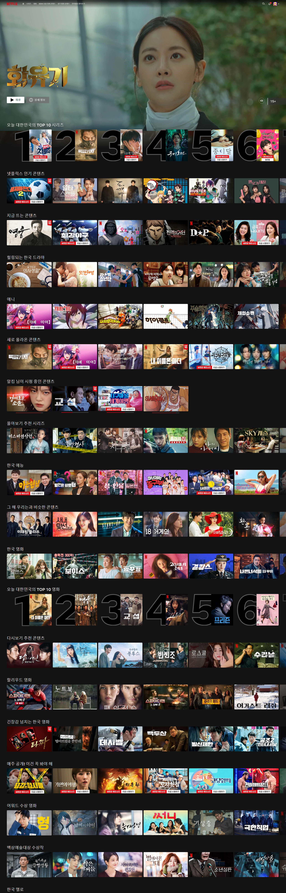
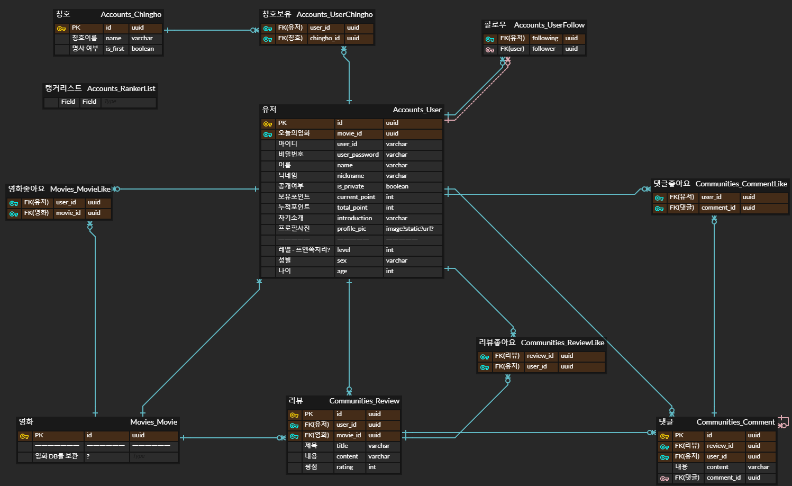
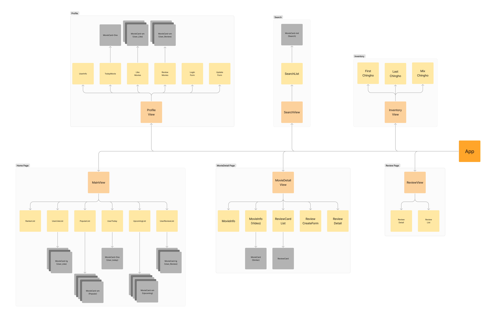

# Read me.md

# **WADAK**

2023 SSAFY 9기 1학기 관통프로젝트 우수상 작품

팝콘이 터지는 의성어에서 유래된 이름.

영화와 관련된 팝콘에서 비롯된 단어로 시작해, 사람이 왁자지껄 모여 대화를 나누는 영화 추천 기반 커뮤니티 웹 서비스를 제공하겠다는 의미에서 이름을 따옴. 또한 유저간의 관계성을 중요하게 생각하는 개발 의도로 ‘와닿다’ 라는 의미도 가지고 있음

# 가. 개발 기획

## 1) 개발 기간

📚2023.05.17 ~ 2023.05.26

## 2_1) 현 문제점 파악

### 이렇게 많은데 볼 게 없네 …

‘넷플릭스 증후군’에 대해 아는가?

최근 OTT 이용자들 사이에서 작품을 고르다 시간을 보내는 ‘넷플릭스 증후군’을 겪는 경우가 늘어나고 있다.

넷플릭스 증후군은 실제 콘텐츠를 감상하는 시간보다 무엇을 볼 지 결정하는 데 걸리는 시간이 더 많은 현상, 또는 작품을 고르다 정작 본 목적인 영화나 드라마 감상은 하지 못하고 시간을 보내는 현상을 말한다.

이러한 증후군이 생기는 원인이 뭘까?

### 치명적인 2가지의 오류, 선택의 역설

[해당 이미지는 넷플릭스의 Main page를 구성하고 있는 모습을 나타냄]

해당 이미지는 넷플릭스의 현재 메인 페이지를 구성하고 있는 모습이다. 첫 번째로 대한민국의 **TOP 10**을 보여주고 이어서 넷플릭스의 **인기** 컨텐츠, 지금 **뜨는** 컨텐츠 순으로 보여주고 있다. 뒤에 이어서 계속 비슷한 양상의 추천 알고리즘이 돌아가고 있다. OTT사이트는 맞춤 / 추천 이라는 단어로 유저에게 다양한 영화를 제공하고 있지만, 결론적으로는 추천이 아닌 영화 자체를 기피하게 되버리는 아이러니한 상황(넷플릭스 증후군)을 만들어 버린다. 그렇다면 OTT 사이트에서 제공하는 알고리즘에 어떤 문제가 있는 것일까?

OTT 플랫폼은 자신들이 제공하는 추천 알고리즘의 실패를 줄이기 위해 2가지의 치명적인 오류를 숨기고 영화를 제공하고 있다.

1. **대중성**

“30대 남성에게 어울리는 영화”, “액션을 좋아하는 사람의 영화” 등 유저의 데이터를 활용하여 유저에게 맞춤 추천을 진행하고 있다. 하지만 이러한 키워드는 속에는 “대중성”이라는 약점이 존재하게 된다. 결론적으로 마지막 단에서 데이터를 분류할 때 레이팅으로 분류한다는 것이다. 이렇게 레이팅에 분류된 데이터는 비슷한 추천 결과를 만들고, 매력적이지 못하게 되어 그저 그런 추천 으로 유저에게 낙인되버린다.

1. **지나치게 많은 양**

그렇게 분류된 데이터가 또한 지나치게 많이 제공된다는 것이 또 다른 문제점이다. 실패를 막기 위해 한 번에 많은 데이터들이 제공되고, 결국 모든 책임은 “선택”해야하는 유저에게 돌아가게 된다. 그렇기에 적절한 선택을 하기위해 유저들이 피로감을 무의식적으로 느끼게 된다.

이러한 추천 알고리즘은 결국에는 **‘선택의 역설**’을 일으키게 된다.

대중적인 선택지가 너무 많으면 오히려 결정에 어려움을 겪을 수 있다는 것이다. 최근에는 사람들이 한 번에 여러 OTT 서비스를 이용하고, 콘텐츠 확보 경쟁이 치열해지며 다양한 콘텐츠가 쏟아져 나오고 있다. 이러한 콘텐츠의 홍수 속에서 하나를 선택하고 보기까지의 과정에서 피로감을 느낄 수 있다. 그렇기에 역설적으로 OTT 서비스를 이용하지 않는 지경에 이르게 된다.

## 2_2) 기획의도

### 긴밀하고 간결한 추천

위에서 언급한 추천이 결코 틀린 것은 아니다. 결국에는 많은 유저들이 이용하고 있고, 매번 OTT에서 나온 컨텐츠는 흥행이 되고, 돌고 돌아 다른 OTT, 다른 플랫폼 등에 파급효과를 일으키고 있다. 하지만 이렇게 “선택의 역설”에 빠져버린 유저가 점차 증가하고 있고, OTT 플랫폼을 더 이상 이용하지 않으려는 유저가 많아지니, 프로그램을 기획하고 개발하는 입장에서는 반드시 해결해야 한다.

### 어떻게? 관계성을 이용하여…

우리는 이러한 문제점을 어떻게 하면 해결할 수 있을까? 이러한 문제를 해결하기 위해서 색다른 추천 알고리즘으로 선택지를 줄여주고, 보다 결정하기 쉬운 기준으로 콘텐츠를 분류해 제시하는 방법이 있다. 넷플릭스에서는 한국에서 인기 많은 순위, 로맨스 드라마 종류 등 선택지를 줄인 추천 알고리즘을 제시하고 있다. 이러한 방식들을 기본적으로 채용하고, 와닥 팀만의 특색있는 추천 알고리즘을 개발하려한다. **관계성**을 이용하여 유저에게 좀 더 세분화 되어있는 맞춤 알고리즘을 제시한다.

`비록 그 알고리즘이 실패하더라도 말이다. 일단 하나 고르게 하자! 선택에 부담을 주지 말자!`

Q. 유저 A는 유저 B에게 긍정적인 반응(호감)을 보인다. 그리고 유저 B는 영화 A를 좋아한다.

-이때 유저 A는 영화 A에 대해 어떻게 생각할까?

Q. 유저 A는 영화 A를 좋아한다. 그리고 유저 A는 유저B에게 긍정적인 반응이 있을 때,

-유저 A는 유저 B가 영화 A에 대해 어떻게 생각했으면 할까?

심리학의 균형 이론(balance theory)에 따르면, 사람들은 사고나 느낌, 행동, 신념 등의 인지 요소들이 심리적으로 조화를 이루고 일관성을 유지(균형사태)하려고 한다. 특히 자기 자신(Person : P), 다른 사람(Other : O), 대상(object : X)간의 삼원관계에서 균형을 유지하려고 하기에, 특정 대상을 평가시, 자신과 다른 사람과의 동일한 방향성을 추구하려 한다. 그렇기에 유저가 다른 사람에게 긍정적(+)인 평가를 가지고 있다면 타인이 좋아하는 영화에 긍정적인 평가를 한다는 것이다.

이러한 심리학적 요인을 이용한다면, 복잡하지 않게 유저간의 긴밀한 관계를 구축할 수 있고, 오로지 유저만의 유저 데이터를 만들어 낼 수 있다. 또한 전체적인 개발의 핵심 방향성을 유저간의 관계성을 만들고, 그러한 관계를 유저간의 상호작용으로 만들 수 있도록, 핵심 추천 알고리즘을 구성하고 상호작용할 수 있는 각종 기능을 구현하려한다.

## 2_3) 핵심 전략

### 2_3_1) 팔로우 기반의 추천 알고리즘

### 2_3_2) 랭커, 인플로언서 등 추천 알고리즘

### 2_3_3) 개성있는 프로필 페이지

### 2_3_4) 관계성을 만드는 방법, 팝콘머신(커뮤니티)

## 3) 개발 환경

### 3_1) Ground rule

- **Git 규칙**

  1. add 규칙
     1. add . 과 같이 전체 파일을 추가해야할 경우가 아니라면 최대한 피할 것
  2. commit 규칙

     1. 기능 이름**파일이름.확장자**수정내역(자세히)
     2. ex) 로그인 폼 수정**accountView.vue**로그인 폼의 디자인적 요소 추가, 서밋 버튼 및 이벤트 추가

  3. merge 주기는 오후 5시로 설정

### 3_2) ERD

- 초기

- 최종

### 3_3) 와이어 프레임

### 3_4) 컴포넌트 구조

### 3_5) URL 구조

|                     | PROJECT | final_pjt_back |                                                         |                      |                            |
| ------------------- | ------- | -------------- | ------------------------------------------------------- | -------------------- | -------------------------- |
|                     |         |                | admin/                                                  |                      | admin.site.urls            |
|                     |         |                | api/v1/accounts/                                        |                      | include('accounts.urls')   |
|                     |         |                | api/v1/movies/                                          |                      | include('movies.urls')     |
|                     |         |                | api/v1/communities/                                     |                      | include('communites.urls') |
|                     |         |                |                                                         |                      |                            |
| api/v1/accounts/    | APP     | accounts       |                                                         |                      |                            |
|                     |         | POST           | signup/                                                 | signup               | 회원가입                   |
|                     |         | POST           | login/                                                  | login                | 로그인                     |
|                     |         | PUT            | update/<int:user_pk>/                                   | update               | 계정 업데이트              |
|                     |         | DELETE         | delete/<int:user_pk>/                                   | delete               | 계정 삭제                  |
|                     |         |                |                                                         |                      |                            |
|                     |         | GET            | profile/<int:user_pk>/                                  | profile_detail       | 프로필페이지               |
|                     |         | POST           | profile/<int:user_pk>/follow/                           | follow               | 팔로우                     |
|                     |         | GET            | profile/<int:user_pk>/review/                           | review_list          | 최근 리뷰 작성한 영화 목록 |
|                     |         | GET            | profile/<int:user_pk>/like/                             | like_list            | 최근 좋아요한 영화 목록    |
|                     |         |                |                                                         |                      |                            |
|                     |         | POST           | chinghopick/                                            | chingho_pick         | 유저 칭호 뽑기             |
|                     |         |                |                                                         |                      |                            |
|                     |         |                |                                                         |                      |                            |
| api/v1/movies/      | APP     | movies         |                                                         |                      |                            |
|                     |         | GET            | recent/                                                 | recent_movie         | 메인페이지 최근 영화       |
|                     |         | GET            | popular/                                                | popular_movie        | 메인페이지 인기순 영화     |
|                     |         | GET            | ranker/                                                 | ranker_today_movie   | 랭커 오늘의 영화           |
|                     |         | GET            | <int:userID>/follow/like/                               | follow_like_movie    | 팔로우 유저 좋아요 영화    |
|                     |         | GET            | <int:userID>/follow/today/                              | follow_today_movie   | 팔로우 유저 오늘의 영화    |
|                     |         | GET            | <int:userID>/follow/review/                             | follow_review_movie  | 팔로우 유저 리뷰 남긴 영화 |
|                     |         |                |                                                         |                      |                            |
|                     |         | GET            | <int:movie_pk>/                                         | movie_detail         | 영화 디테일                |
|                     |         | GET            | <int:movie_pk>/similar/                                 | movie_detail_similar | 관련 영화 추천             |
|                     |         | POST           | <int:movie_pk>/today/                                   | movie_today          | 오늘의 영화 설정           |
|                     |         | POST           | <int:movie_pk>/like/                                    | movie_like           | 영화 좋아요                |
|                     |         |                |                                                         |                      |                            |
|                     |         | GET            | search/<str:keyword>/                                   | movie_search         | 영화 검색                  |
|                     |         |                |                                                         |                      |                            |
|                     |         |                |                                                         |                      |                            |
| api/v1/communities/ | APP     | communities    |                                                         |                      |                            |
|                     |         | GET            | allreviews/                                             | total_review_list    | 모든 영화 리뷰 리스트      |
|                     |         |                |                                                         |                      |                            |
|                     |         | GET            | movie/<int:movie_pk>/review/                            | review_list          | 해당 영화 리뷰 리스트      |
|                     |         | POST           | movie/<int:movie_pk>/review/create/                     | review_create        | 해당 영화 리뷰 작성        |
|                     |         | GET            | movie/<int:movie_pk>/review/<int:review_pk>/            | review_detail        | 해당 영화 리뷰 디테일      |
|                     |         | DELETE         | movie/<int:movie_pk>/review/<int:review_pk>/delete/     | review_delete        | 해당 영화 리뷰 삭제        |
|                     |         | POST           | movie/<int:movie_pk>/review/<int:review_pk>/like/       | review_like          | 해당 영화 리뷰 좋아요      |
|                     |         |                |                                                         |                      |                            |
|                     |         | GET            | review/<int:review_pk>/comment/                         | comment_list         | 해당 리뷰 댓글 리스트      |
|                     |         | POST           | review/<int:review_pk>/comment/create/                  | comment_create       | 해당 리뷰 댓글 작성        |
|                     |         | DELETE         | review/<int:review_pk>/comment/<int:comment_pk>/delete/ | comment_delete       | 해당 리뷰 댓글 삭제        |

# 나. 프로젝트 소개

## 개발 도구

- Back-end: Django
- DataBase: Sqlite3
- Front-end: Vue, Vuex, VueBootStrap
- 아키텍처
  - Django REST framework & Vue

## 주요 기능

ㅎ. 서비스 이용시

.png>)

- 서비스 이용시 비로그인 상태라면 로그인 이용을 경고
- 서비스는 로그인 한 상태에서만 이용 가능

ㄱ. 메인 페이지

.png>)

.png>)

- 총 6개의 핵심 추천 알고리즘이 돌아감
  1. 랭커의 픽 무비
  2. 내 팔로워가 좋아요한 영화
  3. 지금 인기있는 영화들
  4. 내 팔로워의 Today Movie
  5. 최근 영화 모음(미개봉작 포함)
  6. 내 팔로워의 최근 리뷰 모음

ㄴ. 회원 가입 페이지

.png>)

- 회원가입시 프로필에 필요한 데이터를 받음

ㄷ. 로그인 페이지

.png>)

- 간단하게 아이디 비밀번호로도 가입 가능

ㄹ. 영화 디테일 페이지

.png>)

.png>)

- 총 2페이지로 구성
  1. 첫페이지에는 해당 영화에 대한 리뷰들이 카드 업 되어있음
  2. 두번째 페이지는 유튜브 API를 이용한 관련 영상과, 추천 영화 카드로 구성

ㅁ. 리뷰 작성 페이지

.png>)

- 리뷰 작성 Create 페이지

ㅂ. 리뷰 디테일 페이지

.png>)

- 해당 리뷰에 대한 디테일 페이지
- 팔로워 버튼으로 작성 유저의 프로필로 갈 수 있음
- 좋아요 및 코멘트 구현

ㅅ. 리뷰 전체 리스트 페이지

.png>)

- 모든 영화에 대한 리뷰 리스트 업
- 해당 리뷰를 클릭하면 해당 리뷰 디테일 페이지로 이동

ㅇ. 서치 페이지

.png>)

- TMDB의 서치 api를 이용해 검색 영화 구현
- FE 에서만 보여주고 해당 영화 카드 클릭시 DB 순회 후 저장

ㅈ. 프로필 디테일 페이지

.png>)

.png>)

- 내 프로필과 타인의 프로필에 따라 팔로잉 버튼 / 수정 버튼 토글
- 칭호 뽑기로 해당 유저의 칭호를 뽑아 저장할 수 있음
- 닉네임 옆의 색깔 팝콘으로 유저의 활동치를 표현
- 유저의 투데이 무비, 최근 좋아요, 최근 리뷰 남긴 영화 등 카드 업

## 세부 기능 명세서

### 업무 분담 내역

김효인 - BackEnd

김영민 - FrontEnd

### 진행도 일지

### 23.05.17

- ERD 작성 및 보완
  
- ERD 에 따른 [Model.py](http://Model.py) 작성
  - accounts 테스트 완료
  - 랭커 미구현 → user 안에 필드로 작성 예정 → 1,2,3,4,5,0 값으로 랭킹 표시
- BE- url 작성
  - 50% 완성 → accounts, movies 완성
- api 요청방식 선택
  - Top Rated(메인페이지), upcoming(메인페이지), similar(profile 페이지)-필터를 추가해야할듯, search(search페이지), detail(movie card) 사용 예정

### 23.05.18

**TO DO LIST**

1. logo.png 만들기 → 웹 포토샵이 안되네..? 집에서 작업해오기
2. 와이어 프레임 만들기
3. 컴포넌트 구조 짜기
4. Vue 앱 에서 FE 이니셜 만들기
5. nav 바 만들기

**DONE**

- 와이어 프레임 완성

- 컨포넌트 구조

- 로고작업

### 23.05.19

**TO DO LIST**

BE

1. model - ranker, review, comment
2. url - 기초작업한거 확인하면서 작업
3. view 작업

FE

1. Vue App 생성
2. 컴포넌트 배치 및 라우터 (이니셜)

**DONE**

BE

- ERD & 모델수정 (23-05-19)

- url 기초 작업 완료

- movies_app views 진행중. (detail / get_genres 완료)

FE

1. Vue App 생성 완료
2. 컴포넌트 배치 및 라우터 (이니셜) 컴포넌트 배치 완료 라우터작업중

### 23.05.20

**TO DO LIST**

BE

1. movies app / Movie - Genre m:n 연결
2. movies app / search 기능 구현
3. AP scheduler , Django lifecycle 이용해 DB 자동갱신 구현
4. accounts app / models.py / User, Chinghos 클래스 구현하기 (Form/ModelForm을 사용하지 않고 커스텀 유저 모델을 사용)

FE

1. 네비 바 생성
2. 네비바에 맞는 페이지 패딩 구성
3. main 페이지 작업 → axios?할거니?

**DONE**

BE

1. movies app / Movie - Genre m:n 연결 완료
2. movies app / search 기능 구현 완료
3. django-apscheduler 설치 & accounts app 클래스 작성 (수정 필요)

FE

1. 네비게이션 바 생성 완료
2. 페이지 패딩 완료
3. 메인페이지 - 랭커 페이지 css 완료

### 2023.05.21

DONE

BE

1. accounts app / 설계 중

FE

1. 메인페이지 구현완료

### 23.05.22

**TO DO LIST**

BE

1. accounts App 기능 구현
2. communities App 기본적인 기능 (review CRUD, comment CRUD, like) 구현하기

FE

1. 무비 디테일 페이지 구현
2. 리뷰 리스트 페이지 구현
3. 리뷰 리스트 정리
4. 리뷰 크리에이트 페이지 구현
5. 리뷰 디테일
6. 로그인
7. 사인업
8. 프로필 업데이트

DONE

BE

1. communites App Review, Comment class CRUD & like 완료. movies App Movie like 완료
2. accounts….

FE

1. 무비 디테일 페이지 구현
2. 리뷰 리스트 페이지 구현
3. 리뷰 리스트 정리
4. 리뷰 크리에이트 페이지 구현
5. 리뷰 디테일 구현 - 업데이트 없애는 생각, 댓글창 구현 / 삭제 버튼 위치 조정, 좋아요 버튼 넣기
6. 로그인 구현
7. 사인업 구현
8. 프로필 업데이트 미구현
9. 검색?

### 23.05.23

**TO DO LIST**

BE

1. ~~accounts App - user password set_password를 통해 암호화해서 저장 (signup / login 함수)~~
2. accounts App - 유저 - 칭호 중개 테이블에 필드(is_selected) 추가 & 중개테이블에서 is_selected 된 거 filter해서 반환하는 함수 구현
3. accounts App - BE / FE axios 를 통해 통신할 때 보내줘야하는 데이터 구체화 및 구현 ( 오전중에 작업할 예정, 각각 필요한 데이터 협의 필요)

   ex ) signup 시 user_pk와 success를 Response로 반환

4. movies App - Movie class 내에 오늘의 영화 필드 구현.

   4 - 1 오늘의 영화 pick 함수 구현

5. 기능 테스트에 따라 Serailizers.py & Views.py Response 수정 (애자일하게)

FE

1. accounts 관련 프론트엔드 작업

   1. main페이지 접속시 로그인 여부 확인작업하기

      → state에 isLogin 여부 확인 후 경고창 안내, 경고창 이후 로그인페이지 라우터연결

   2. Signup 에 비밀번호 확인창 만들기
   3. 로그인 여부에 따라 Logout 라우터 보여주기

2. 유저 Today Movie 설정하기

   → MovieDetail/MovieInfo 에 즐겨찾기 버튼 추가하기

3. ProfileUpdateForm 만들기
4. 추가 과제 컴포넌트 추가하기

   4-1. Inventory components add

   4-2. recomments components add

BE - FE

(오전)

1. accounts 모델 설계 테스트
2. accounts 모델 vue와 연결해서 Axios 통신 테스트
3. Signup, Login, isLogin, Logout 데이터 값 확인 및 연결

(오후)

1. Movies 모델 설계 테스트
2. Movies 모델 vue와 연결해서 Axios 통신 테스트
3. Mainview, MovieDetail 데이터 값 확인 및 연결
4. (시간이 남는다면) community 설계 테스트 → Review CRUD 확인

### 23.05.24

**TO DO LIST**

BE

1. accounts App / follow 함수에서 is following 여부 FE로 전달하도록 수정
2. communities App / CRUD FE와 통신하면서 agile하게 수정 필요
3. User Serializer 세분화해서 여러개로 작성 ( 필요한 정보에 따라 다르게 사용)
4. 오늘의 영화 pick 함수 추가
5. communities App /
   FE
6. Accounts App updateForm axios연결
7. Community App CRD axios 연결
8. user follow axios 연결
9. Movie App Like axios 연결(movie_like 여부, movie_today여부)
10. Main App 남은 axios 연결(Ranker pick, user today, userlike, userreview)
11. 버그 수정(2개, 장르 받아올 시 에러, fullpath&scrollBehavior 처리)

**DONE**

BE

1. movies App / 오늘의 영화 pick 함수 추가

.png>)

### 23.05.24

**TO DO LIST**

1. 최종 핫 픽스 및 토글 버튼 작업
2. 버그 수정

### 느낀점

**김효인** - 시간이 너무 모자랐다. 구현하고 싶었던 기능이 많았는데 마감 기한을 지키기 위해 타협한 부분이 많아서 아쉬웠다. 하지만 초기에 구현하려고 했던 핵심 기능( 랭커, 오늘의 영화, 팔로우 등을 통한 유저 기반 추천 )을 완성했다는 점이 뿌듯하다. 프론트를 잘 구현해준 영민이에게 감사의 인사를

**김영민 -** 직접 설계하고 프로젝트 하니 굉장히 몰입감이 좋았다. 좋은 페어와 같은 방향성으로 기획하고, 설계하고, 구현하는 과정이 만족스러웠다. 하지만 초반 설계대로 진행되지 않았고 중간에 치명적인 오류(DB저장문제) 등을 만나면서 멘탈이 많이 부서졌지만, 바로 다잡고 진행하여서 시간내에 완주 할 수 있었던 것 같다. 많은 핵심기능을 담아냈고, 80% 이상의 완성도를 만들어 낸 것 같다. 혼자했으면 어려웠겠지만 같이 하는 페어가 있음에 무한의 감사를…

